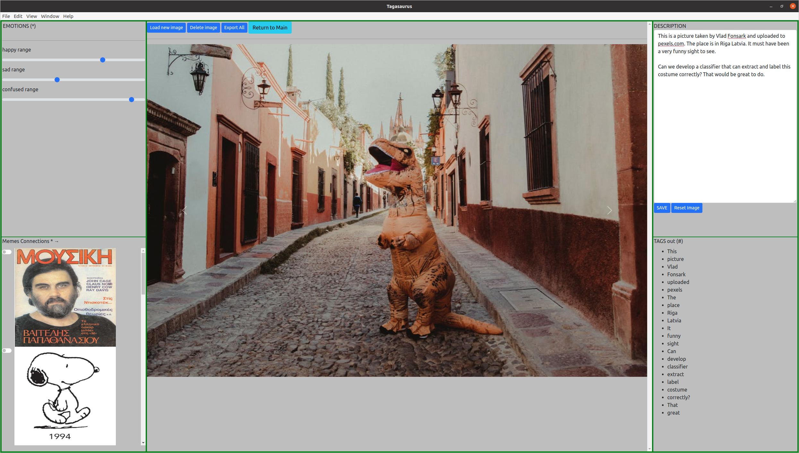

---
title: 'Tagasaurus: A tool for effective image corpus annotations with human descriptions and sentiment'
tags:
  - hashtags
  - electronjs
  - image annotation
  - user interface
  - database
authors:
  - name: Alexander V. Mantzaris^[corresponding author]
    orcid: 0000-0002-0026-5725 
    affiliation: 1
  - name: Randyll Pandohie
    orcid: 0000-0002-6164-9714
    affiliation: 1
  - name: Michael Hopwood
    orcid: 0000-0001-6190-1767
    affiliation: 1
  - name: Patrick Pho
    orcid: 0000-0002-3127-9812
    affiliation: 1
  - name: Dustin Ehling
    affiliation: 2
  - name: Thomas G. Walker
    affiliation: 2
affiliations:
 - name: Deptartment of Statistics and Data Science, University of Central Florida
   index: 1
 - name: Independent Researcher
   index: 2
date: 20 September 2021
bibliography: paper.bib

# Summary

Large collections of images are held by individuals who wish to locally store the photos they
take, by online web services providing image sharing capabilities and researchers in
machine learning working on developing classifiers for object detection. An individual storing
their photos is often limited in the range of meta data they can associate with images without
resorting to storing the information in separate files since although description entry fields
are common; the ability to record the emotions explicitly is not. Machine learning research in
object detection is increasingly looking to label images with objects from complex scenes where
there are multiple objects to detect. Another is with networked data common to social media
where the classification of reactions for predictions is of interest and here having a composite
of tags, emotions and image associations (memes) is of value to train a model. Tagasaurus,
provides a tool for users to manually insert image annotation information as metadata stored in
an in browser database. This collection of annotations with the image store can be exported for
subseqent analysis in the machine learning use case, or used by individuals as a type of 'lifeblog'
to remember the sentiment with their descriptions.

# Statement of need

`Gala` is an Astropy-affiliated Python package for galactic dynamics. Python
enables wrapping low-level languages (e.g., C) for speed without losing
flexibility or ease-of-use in the user-interface. The API for `Gala` was
designed to provide a class-based and user-friendly interface to fast (C or
Cython-optimized) implementations of common operations such as gravitational
potential and force evaluation, orbit integration, dynamical transformations,
and chaos indicators for nonlinear dynamics. `Gala` also relies heavily on and
interfaces well with the implementations of physical units and astronomical
coordinate systems in the `Astropy` package [@astropy] (`astropy.units` and
`astropy.coordinates`).

`Gala` was designed to be used by both astronomical researchers and by
students in courses on gravitational dynamics or astronomy. It has already been
used in a number of scientific publications [@Pearson:2017] and has also been
used in graduate courses on Galactic dynamics to, e.g., provide interactive
visualizations of textbook material [@Binney:2008]. The combination of speed,
design, and support for Astropy functionality in `Gala` will enable exciting
scientific explorations of forthcoming data releases from the *Gaia* mission
[@gaia] by students and experts alike.

# Mathematics

Single dollars ($) are required for inline mathematics e.g. $f(x) = e^{\pi/x}$

Double dollars make self-standing equations:

$$\Theta(x) = \left\{\begin{array}{l}
0\textrm{ if } x < 0\cr
1\textrm{ else}
\end{array}\right.$$

You can also use plain \LaTeX for equations
\begin{equation}\label{eq:fourier}
\hat f(\omega) = \int_{-\infty}^{\infty} f(x) e^{i\omega x} dx
\end{equation}
and refer to \autoref{eq:fourier} from text.

# Citations

Citations to entries in paper.bib should be in
[rMarkdown](http://rmarkdown.rstudio.com/authoring_bibliographies_and_citations.html)
format.

If you want to cite a software repository URL (e.g. something on GitHub without a preferred
citation) then you can do it with the example BibTeX entry below for @fidgit.

For a quick reference, the following citation commands can be used:
- `@author:2001`  ->  "Author et al. (2001)"
- `[@author:2001]` -> "(Author et al., 2001)"
- `[@author1:2001; @author2:2001]` -> "(Author1 et al., 2001; Author2 et al., 2002)"

# Figures

{ width=80% } and referenced from text using \autoref{fig:tagging}.

Figure sizes can be customized by adding an optional second parameter:
{ width=80% }

# Acknowledgements

We acknowledge contributions from Brigitta Sipocz, Syrtis Major, and Semyeong
Oh, and support from Kathryn Johnston during the genesis of this project.

# References
